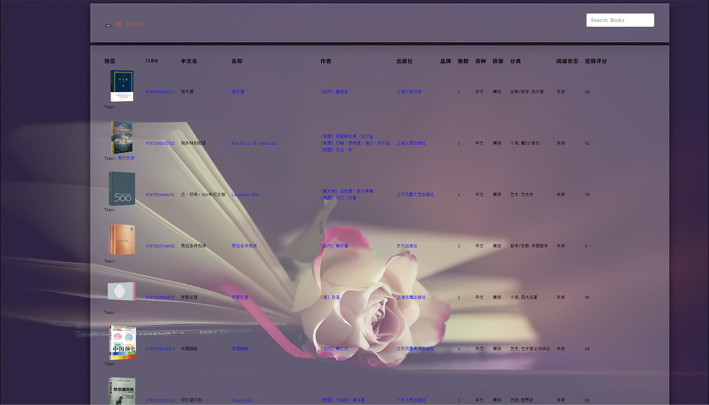
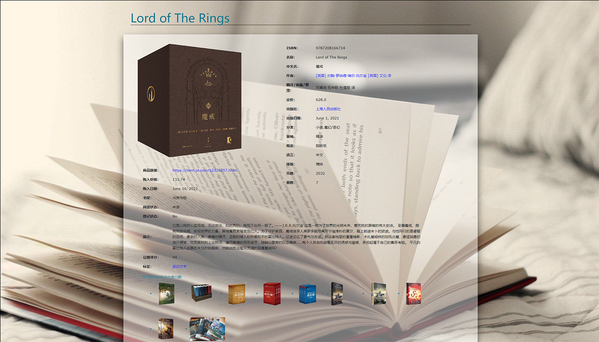

# library
This App is used to manage the books I own
Restful API is provided to manage the books, authors, producers and so on.

# Preview
- Book list view

    

- Book eetails view

    

- Author and his/her books

    

- Publisher and its published books

    

- Book series view

    

- Reading plan
    

# Usage
- Running on windows.  
    ```bash
    python manage.py runserver 
    ```
- Running in WSL with uWSGI and NGINX.  
    ```bash
    uwsgi --ini config/uwsgi_wsl.ini
    ```
- Running in Docker container.  
    ```bash
    # Build docker conainer.
    docker build -t library .
    # Run with docker container.
    docker run -it -p 8080:8080 -p 8443:8443 -e DJANGO_SUPERUSER_USERNAME=admin -e DJANGO_SUPERUSER_PASSWORD=******** -e DJANGO_SUPERUSER_EMAIL=admin@example.com library
    ```